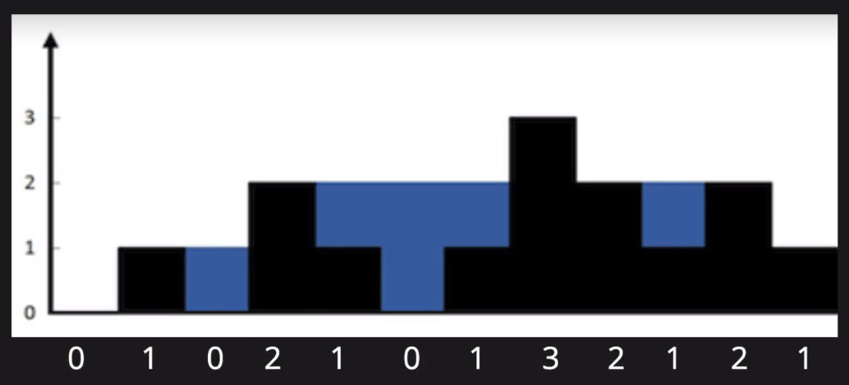

# DS-Practice

## Array and Vectors
1. Pairs :Given an array containing N integers, and an number S denoting a target sum. Find two distinct integers that can pair up to form target sum. 

2. Triplets : Given an array containing N integers and a number S denoting a target sum.Find all distinct integers that can add up to form target sum. The number in each triplet shpuld be orderd ascending order and triplet sould be ordered 
to. Return empty array if no. such triplet exists.

3. Mountain : Write a function that takes input an array of distinct integers and returns the length of highest mountain. A mountain is defined as adjacent integers that are strictly increasing until they reach apeak at which it becomes strictly decreasing. Atleast 3 no. are required to form mountain.

4. Longest Band : Given an array containing N integers, find length of longest band. Band is defined as a subsequence which can be reordered in such a manner all element appear consecutive(i.e with absolute difference of 1 between neighbouring elements). A longest band is the band(subsequence) which contains maximum integers.

5. Rains : Given n non-negative integers representing an elevation map where width of each bar is 1, compute how much water it can trap after raining. 
          
       
6. Subarray Sort : Given an array of size atleast 2, find the smallest subarray that needs to be sorted in place so that entire input array becomes sorted.
if the input array is already sorted, the function should return[-1,-1], otherwiise return the start and end index of smallest subarray.

7. Min Swaps : Given an array of size N, find the minimum number of swaps needed to make the array as sorted.

8. Minimum Difference : Implement a function that takes in two non-empty arrays of integers, finds the pair of number(one from each array) who absolute difference is closest to zero, and returns a pair containing theses two numbers, with the first number from array.

## String Problems

1. To be added 